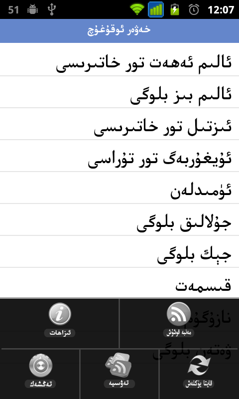
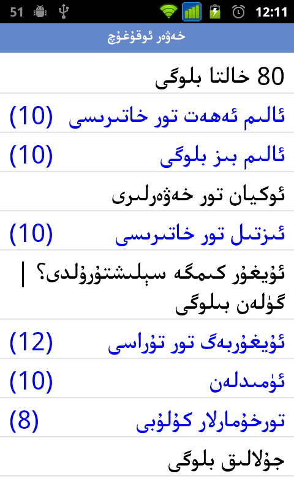
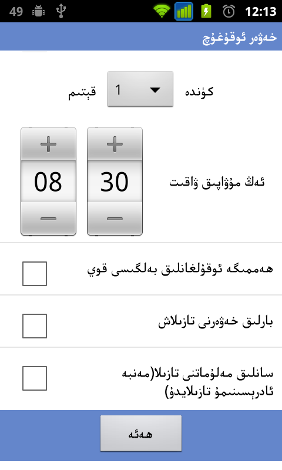

RSSReader
=========

An Android app designed to read news from Uyghur websites and blogs. This app parses RSS feeds from a default feedlist page.

Screenshots
---------

How To Use
---------
Change the default feedlist and share page address to your url of choice at Configs.java.

Download Link
---------
[Download from Google Play](https://play.google.com/store/apps/details?id=net.uyghurdev.avaroid.rssreader)

[Download from Bilkan Bazar](http://bazar.bilkan.net/App.aspx?id=89)

RSS 2.0 Specifications
---------
http://cyber.law.harvard.edu/rss/rss.html
